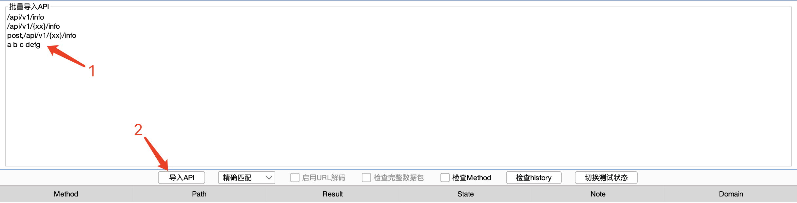
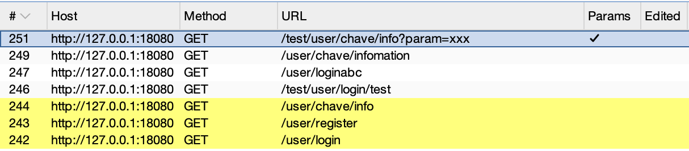
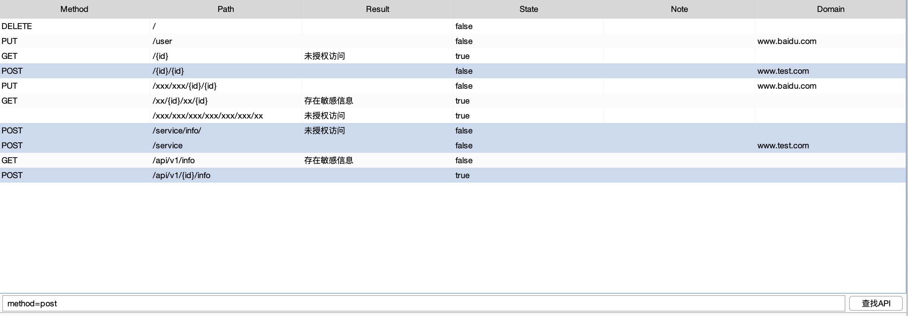
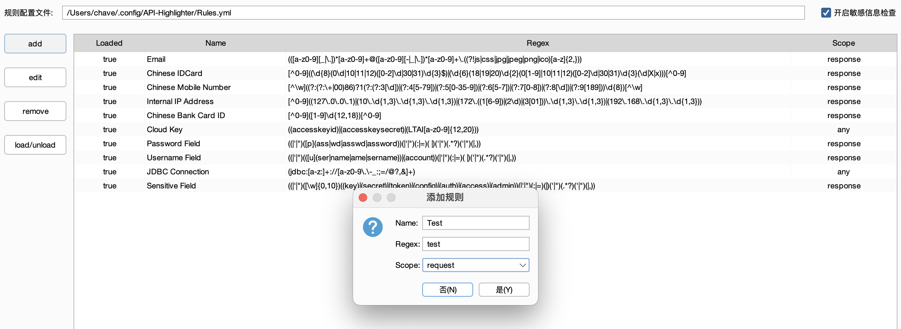

# API Highlighter
API Highlighter 是一个用于 BurpSuite 的插件，旨在帮助用户在拦截到的流量中高亮显示和处理特定的 API 请求。该插件最初用 Python 编写，现重构为 Java 版本。

## 项目背景

随着新版 API 的引入，许多原先的历史 API 即将废弃，为了提供更好的支持和兼容性，重构插件逐渐推上日程。

在最初的 Python 版本中，由于依赖包较多且配置复杂，导致用户在安装和使用过程中遇到了一定的困难。为了简化插件的安装过程、提高执行性能并减少依赖问题，我们决定开发 Java 版本的 API Highlighter。

Java 版本不仅更好地与 BurpSuite 环境集成，而且通过减少第三方依赖，降低了安装门槛。希望通过这一改进，为用户提供更为流畅和高效的使用体验。

原项目：https://github.com/Flechzao/API-Highlighter

## 功能

### API 高亮

#### 导入 API

导入格式如下：

- \<Path\>
  - 仅传入 Path 时，无论是否勾选 ``检查Method``，默认匹配所有 HTTP 方法。
  - \<Path\> 支持解析 `PathVariable` ，格式为 `{任意字符}`。
- \<Method\>,\<Path\>
  - `Method` 与 `Path` 之间使用 `,` 分隔。当勾选 ``检查Method`` 时，当前 Path 仅匹配指定 HTTP 方法。
  - \<Path\> 支持解析 `PathVariable` ，格式为 `{任意字符}`。
- xxxxx
  - 传入任意字符进行匹配，通常用于模糊匹配。

#### 选择匹配模式

不同匹配模式仅针对 Path。

##### 精确匹配

选择精确匹配模式时，不支持 `启用URL编码`、`检查完整数据包`。

精确匹配仅匹配 API，不匹配 GET 请求参数，且需要 API 完全匹配。

导入如下内容。

此时可匹配接口 `/user/register`，`/user/login`，`/user/chave/info`。

但无法匹配 `/test/user/login/test`，`/user/loginabc`，`/user/chave/infomation`，`/test/user/chave/info` 以及 `参数中的xxx`。

##### 半模糊匹配

选择半模糊匹配模式时，不支持 `启用URL编码`、`检查完整数据包`。

半模糊匹配仅匹配 API，不匹配 GET 请求参数，但支持匹配不完全相同 API。

导入如下内容。

此时可匹配接口 `/user/login`，`/user/register`，`/user/chave/info`，`/test/user/login/test`，`/test/user/chave/info/abc`。

但无法匹配 `/user/loginabc`，`/user/chave/infomation`，`/xxx`，`/testxxx` 以及 `参数中的xxx`。

##### 模糊匹配

选择模糊匹配模式时，支持 `启用URL编码`、`检查完整数据包`。

模糊匹配在默认情况下，匹配 `Path + 参数`。

导入如下内容。

###### 解析 PathVariable

切换到模糊匹配模式时，会弹出窗口，选择是否解析 PathVariable。选择 `是` 则解析，选择 `否` 则不解析。

当解析 PathVariable 时，此时可匹配接口 `/test/user/abc/infomation` 与参数 `/test/user/abc/infoamtion`，`/test/user/{name}/infomation`。

当选择不解析 PathVariable 时，此时无法匹配接口 `/test/user/abc/infoamtion` 与参数 `/test/user/abc/infoamtion`，仅可匹配参数 `/test/user/{name}/infomation`。

###### 启用 URL 编码

当未勾选 `启用URL解码` 时，此时无法匹配参数中经过 URL 编码的 `a b c d e f g`。

勾选 `启用URL解码`，此时会对 request 进行 URL 解码，此时可匹配参数中经过 URL 编码的 `a b c d e f g`。

###### 检查完整数据包

当未勾选 `检查完整数据包` 时，此时仅检查请求 `Path + 参数`，未检查数据包中其他内容。

此时无法匹配请求体中的 `a b c d e f g` 与 `xxx`。

勾选 `检查完整数据包时` 时，此时将检查整个数据包，此时可匹配 `a b c d e f g`，`xxx`。

该功能可与 `启用URL解码` 同时开启，可匹配完整请求中被 URL 编码的数据。

#### 检查 Method

勾选 `检查Method` 后，需要 Method 与 Path 同时匹配才会高亮。

若 Method 为空，勾选 `检查Method` 依然匹配所有 HTTP 方法。

#### 检查 history

点击 `检查history` 后，会根据当前配置情况重新检查 history 中所有记录，原高亮记录会被覆盖。

#### 切换测试状态

选择一条或多条 API，点击 `切换测试状态`，可切换选中条目测试状态。

当 **State** 为 **true** 时，该条 API 不再进行匹配。

#### 操作 API 列表

##### 修改数据

- 修改 Method
  - 仅支持修改为 GET、POST、PUT、DELETE、OPTIONS。
- 修改 State
  - 仅支持修改为 true、false。
- 修改 Path、Result、Note、Domain
  - 无限制

##### 删除数据

选中一条或多条 API，按下退格键即可删除选中条目。

##### 列表排序

暂不支持...

#### 查找 API

##### 快速查找

- \<Path\>：精确查找 Path，并选中。
- \<Method\>,\<Path\>：精确查找 Method + Path，并选中。
- *：选中全部条目。

##### 条件查找

按条件信息查找，如 `method=get`，`path=/service`，`result=xxx`，`state=true` 等。

不支持多条件搜索，不支持模糊搜索。

### 敏感信息检查

目前采用 HaE 部分敏感信息规则进行检查。

首次安装插件时，会在当前用户目录下创建配置文件夹。

#### 开启功能

开启敏感信息检查功能必须先导入 API，该功能仅对 API 列表中匹配的记录进行检查。

导入 API 后，在 `Sensitive Info` 标签页勾选开启敏感信息检查。该勾选状态默认不勾选，状态不保存。

初次启用功能由于配置文件不存在，会询问是否使用默认规则，选择是即可自动创建规则文件。

插件自带规则均来自 HaE 插件部分敏感信息规则。

#### 编辑规则

所有修改均同步本地配置文件。

##### 添加规则

##### 修改规则

##### 删除规则

支持选中多条规则同时删除。

##### 切换规则启用状态

支持选中多条规则同时切换状态，`true=启用`，`false=未启用`。

#### 功能效果

开启敏感信息检查后，当 API 列表中匹配到敏感信息时，`history` 中标记为 `橙色`，同时列出匹配到的字段信息。

同时 API 列表中 `Result` 字段提示 `存在敏感信息`。

## 更新计划

- HaE 规则敏感信息检查（v2.0.0 已完成）
- API 未授权访问检查（v3.0.0 开发中）
